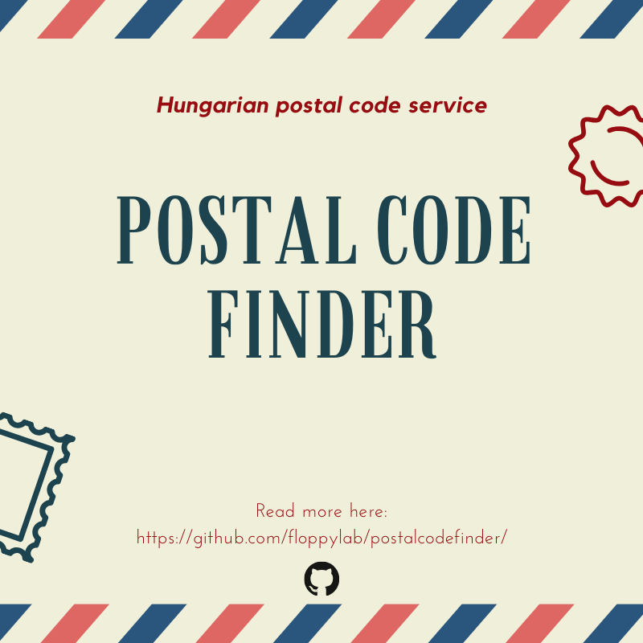

# postalcodefinder

A very simple Hungarian postal code service.

The application can be found temporarily here: https://postalcodefinder-prod.herokuapp.com

## Goal

Inspired by the [postal code finder](https://posta.hu/szolgaltatasok/iranyitoszam-kereso) service of Hungary Post, this application should serve postal code data through a simple API. 

## Contribution

I'm really glad you're reading this, thanks for taking the time to contribute! :)

Please check out the current issues, or if you've found a bug, report it.
PRs are welcome! :)

To be able to run the application you have to enter the database url and credentials, so please contact me and I will share :)

## Contact

Please feel free to contact me: info [at] floppylab [dot] com

